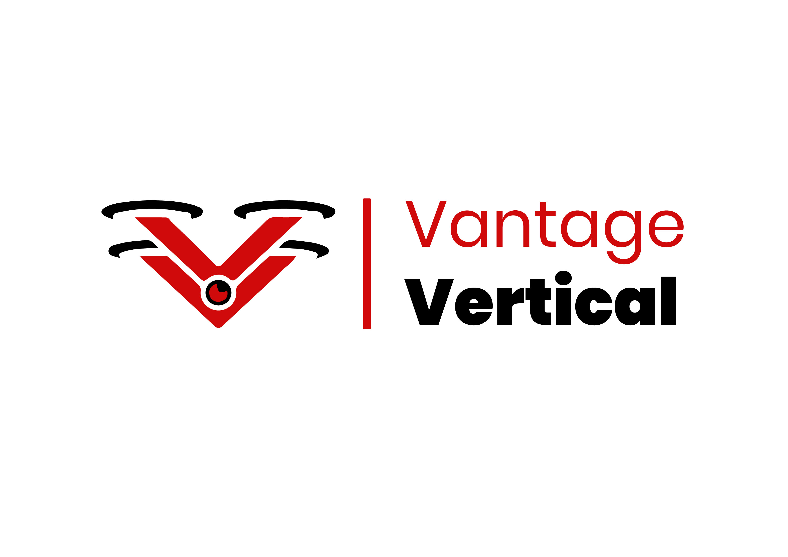

# Vantage Vertical - Drone & Aerial Services Website

<div align="center">
  
  
  **Professional Drone Services | Aerial Mapping | Surveillance | Photography**
</div>

## Table of Contents

1. [About](#about)
2. [Features](#features)
3. [Tech Stack](#tech-stack)
4. [Prerequisites](#prerequisites)
5. [Installation](#installation)
6. [Usage](#usage)
7. [API Endpoints](#api-endpoints)
8. [Project Structure](#project-structure)
9. [Environment Variables](#environment-variables)
10. [Contributing](#contributing)
11. [License](#license)
12. [Contact](#contact)

## About

Vantage Vertical is a comprehensive web platform for a professional drone and aerial services company specializing in:

- **Aerial Photography & Videography** - Capturing stunning visuals from unique perspectives
- **Aerial Mapping & Surveying** - Precision mapping for construction, agriculture, and land development
- **Surveillance Services** - Security and monitoring solutions using advanced drone technology
- **Drone Training** - Professional certification and training programs
- **Equipment Portfolio** - Showcasing partnerships with leading drone manufacturers (DJI, Kolida, Baofeng)

The platform features a modern React.js frontend with smooth animations and a Node.js/Express backend with MongoDB integration for contact form submissions.

## Features

### Frontend Features
- 🎨 **Modern Responsive Design** - Optimized for all devices
- 🚀 **Smooth Animations** - Powered by Framer Motion
- 📱 **Single Page Application** - React Router for seamless navigation
- 🎯 **Interactive Components** - Engaging user experience
- 📧 **Contact Form** - Client inquiry submission with validation
- 🖼️ **Portfolio Gallery** - Showcase of drone work and brand partnerships
- 📝 **Blog Section** - Industry insights and company updates

### Backend Features
- 🔒 **Secure API** - Express.js with CORS protection
- 💾 **Database Integration** - MongoDB for data persistence
- ✅ **Form Validation** - Server-side validation for contact submissions
- 🔄 **RESTful API** - Clean API endpoints for frontend communication

### Business Features
- 🏢 **Brand Partnerships** - Showcase of equipment partners
- 🎓 **Training Programs** - Information about drone certification courses
- 📊 **Technology Stack** - Transparent display of technical capabilities
- 📞 **Contact Management** - Streamlined client inquiry handling

## Tech Stack

### Frontend
- **React.js 18.2.0** - Modern JavaScript framework
- **React Router DOM** - Client-side routing
- **Framer Motion** - Animation library
- **Axios** - HTTP client for API calls
- **React Icons** - Icon library
- **CSS3** - Custom styling with CSS variables
- **EmailJS** - Email service integration

### Backend
- **Node.js** - JavaScript runtime
- **Express.js** - Web application framework
- **MongoDB** - NoSQL database
- **Mongoose** - MongoDB object modeling
- **CORS** - Cross-origin resource sharing
- **Body Parser** - Request parsing middleware

### Development Tools
- **Concurrently** - Run multiple npm scripts simultaneously
- **Create React App** - React development environment
- **Tailwind CSS** - Utility-first CSS framework (dev dependency)

## Prerequisites

Before you begin, ensure you have the following installed on your system:

- **Node.js** (version 14.0 or higher) - [Download here](https://nodejs.org/)
- **npm** (comes with Node.js) or **yarn**
- **MongoDB** (version 4.0 or higher) - [Download here](https://www.mongodb.com/try/download/community)
- **Git** - [Download here](https://git-scm.com/)

### Verify Installation

```bash
node --version
npm --version
mongod --version
```

## Installation

### 1. Clone the Repository

```bash
git clone https://github.com/Pronothurah/vantage_vertical_web.git
cd vantage_vertical_web
```

### 2. Install Root Dependencies

```bash
npm install
```

### 3. Install Frontend Dependencies

```bash
cd frontend
npm install
cd ..
```

### 4. Install Backend Dependencies

```bash
cd backend
npm install
cd ..
```

### 5. Start MongoDB

Make sure MongoDB is running on your system:

**Windows:**
```bash
mongod
```

**macOS (with Homebrew):**
```bash
brew services start mongodb-community
```

**Linux:**
```bash
sudo systemctl start mongod
```

## Usage

### Development Mode

From the root directory, start both frontend and backend servers:

```bash
npm start
```

This will run:
- **Frontend**: http://localhost:3000
- **Backend**: http://localhost:5000

### Individual Server Commands

**Start only the backend:**
```bash
npm run server
```

**Start only the frontend:**
```bash
npm run client
```

### Production Build

**Build the frontend for production:**
```bash
cd frontend
npm run build
```

### Testing

**Run frontend tests:**
```bash
cd frontend
npm test
```
#
# API Endpoints

### Messages API

**Base URL:** `http://localhost:5000/api`

#### POST /messages
Submit a new contact form message.

**Request Body:**
```json
{
  "username": "string (min 3 characters)",
  "email": "string (valid email format)",
  "text": "string (min 10 characters)"
}
```

**Response:**
```json
{
  "_id": "string",
  "username": "string",
  "email": "string",
  "text": "string",
  "__v": 0
}
```

**Status Codes:**
- `201` - Message created successfully
- `400` - Validation error or bad request

## Project Structure

```
vantage_vertical_web/
├── frontend/                    # React.js frontend application
│   ├── public/                  # Static assets
│   │   ├── index.html          # Main HTML template
│   │   ├── favicon.ico         # Site favicon
│   │   └── manifest.json       # PWA manifest
│   ├── src/                    # Source code
│   │   ├── components/         # Reusable React components
│   │   │   ├── about/          # About section component
│   │   │   ├── banner/         # Banner component with quote
│   │   │   ├── brand/          # Brand showcase component
│   │   │   ├── formvalidation/ # Contact form with validation
│   │   │   ├── home/           # Home page component
│   │   │   ├── navbar/         # Navigation bar
│   │   │   ├── portfolio/      # Portfolio and partners showcase
│   │   │   ├── scroll/         # Scroll to top functionality
│   │   │   ├── technology/     # Technology stack display
│   │   │   └── training/       # Training programs info
│   │   ├── containers/         # Layout containers
│   │   │   ├── blog/           # Blog section
│   │   │   ├── footer/         # Site footer
│   │   │   └── header/         # Site header
│   │   ├── assets/             # Images and static files
│   │   │   ├── *.jpg           # Drone and company images
│   │   │   ├── *.png           # Logos and icons
│   │   │   └── *.pdf           # Company documents
│   │   ├── App.js              # Main application component
│   │   ├── App.css             # Global styles
│   │   ├── index.js            # Application entry point
│   │   └── index.css           # Base CSS with custom properties
│   ├── package.json            # Frontend dependencies
│   └── README.md               # Create React App documentation
├── backend/                    # Node.js/Express backend
│   ├── controllers/            # Request handlers
│   │   └── index.js            # Controller exports
│   ├── models/                 # Database models
│   │   └── Message.js          # Message schema definition
│   ├── routes/                 # API route definitions
│   │   └── messageRoutes.js    # Message-related routes
│   ├── index.js                # Server entry point
│   └── package.json            # Backend dependencies
├── package.json                # Root package.json with scripts
├── README.md                   # Project documentation
├── LICENSE                     # MIT license
└── .gitignore                  # Git ignore rules
```

## Environment Variables

### Backend Environment Variables

Create a `.env` file in the `backend/` directory:

```env
# Database Configuration
MONGODB_URI=mongodb://localhost:27017/vantage_vertical
DB_NAME=vantage_vertical

# Server Configuration
PORT=5000
NODE_ENV=development

# CORS Configuration
FRONTEND_URL=http://localhost:3000
```

### Frontend Environment Variables

Create a `.env` file in the `frontend/` directory:

```env
# API Configuration
REACT_APP_API_URL=http://localhost:5000/api

# EmailJS Configuration (if using)
REACT_APP_EMAILJS_SERVICE_ID=your_service_id
REACT_APP_EMAILJS_TEMPLATE_ID=your_template_id
REACT_APP_EMAILJS_PUBLIC_KEY=your_public_key
```

## Contributing

We welcome contributions to improve Vantage Vertical! Here's how you can help:

### Getting Started

1. Fork the repository
2. Create a feature branch (`git checkout -b feature/amazing-feature`)
3. Make your changes
4. Commit your changes (`git commit -m 'Add some amazing feature'`)
5. Push to the branch (`git push origin feature/amazing-feature`)
6. Open a Pull Request

### Development Guidelines

- Follow the existing code style and conventions
- Write clear, descriptive commit messages
- Add comments for complex logic
- Test your changes thoroughly
- Update documentation as needed

### Code Style

- **Frontend**: Follow React best practices and hooks patterns
- **Backend**: Use Express.js conventions and async/await patterns
- **CSS**: Use the existing CSS custom properties system
- **JavaScript**: Use ES6+ features and consistent formatting

### Reporting Issues

If you find a bug or have a suggestion:

1. Check if the issue already exists
2. Create a detailed issue report
3. Include steps to reproduce (for bugs)
4. Add screenshots if applicable

## License

This project is licensed under the MIT License - see the [LICENSE](LICENSE) file for details.

### MIT License Summary

- ✅ Commercial use
- ✅ Modification
- ✅ Distribution
- ✅ Private use
- ❌ Liability
- ❌ Warranty

## Contact

### Vantage Vertical

- **Website**: [Your Website URL]
- **Email**: [Your Contact Email]
- **Phone**: [Your Phone Number]
- **Address**: [Your Business Address]

### Development Team

- **Developer**: [Your Name]
- **GitHub**: [@Pronothurah](https://github.com/Pronothurah)
- **Project Repository**: [vantage_vertical_web](https://github.com/Pronothurah/vantage_vertical_web)

### Social Media

- **LinkedIn**: [Your LinkedIn Profile]
- **Twitter**: [Your Twitter Handle]
- **Instagram**: [Your Instagram Handle]

---

<div align="center">
  <p><strong>Vantage Vertical - Elevating Perspectives Through Technology</strong></p>
  <p>© 2024 Vantage Vertical. All rights reserved.</p>
</div>